# Jasmin Kang Portfolio Assignment

## URL

<https://jasmin-kang-portfolio.netlify.app/>

## GitHub Repo

<https://github.com/jasminkang/Portfolio.git">

## Description of site

Purpose: to attract recruiters/employers and show what I can bring to work including skills and personality

Functionality/features: Simple navigation, clear user experience via navbar, easy to understand content, accessible, contact form, links to relevant external sites, layout for mobile and desktop, URL with name and subject

Sitemap: 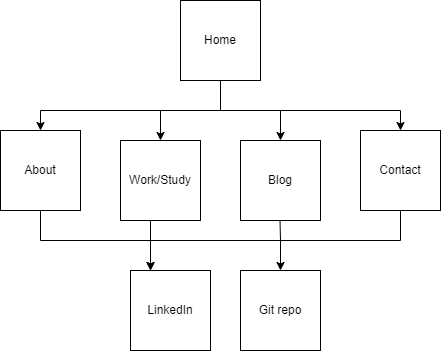

Screenshots for desktop:
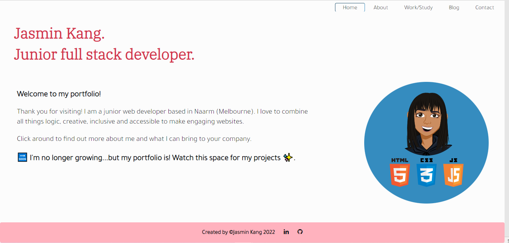
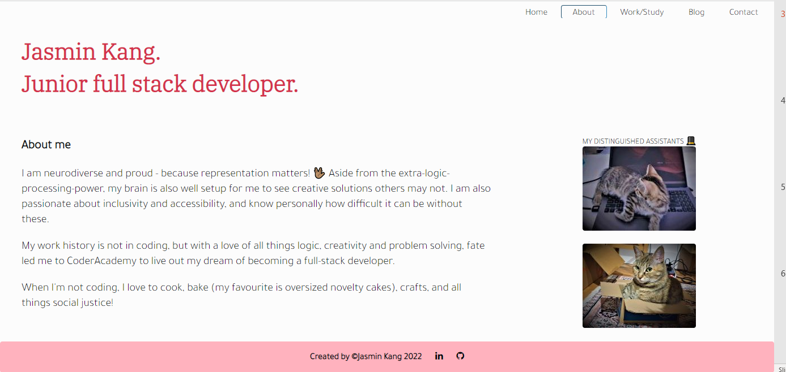
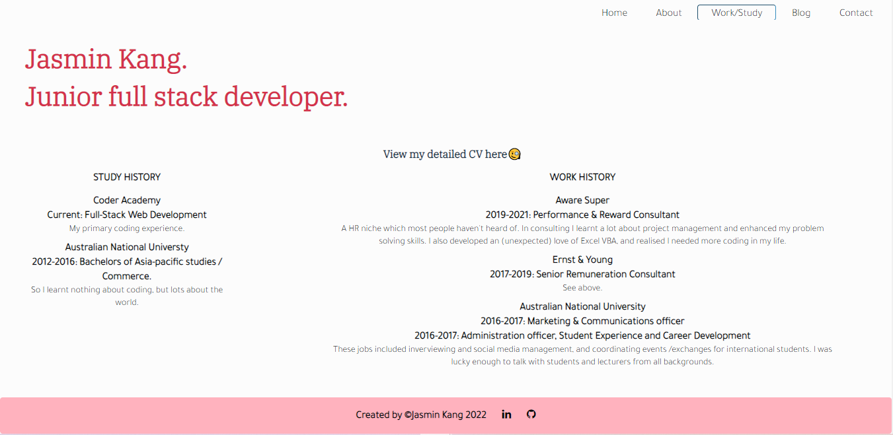
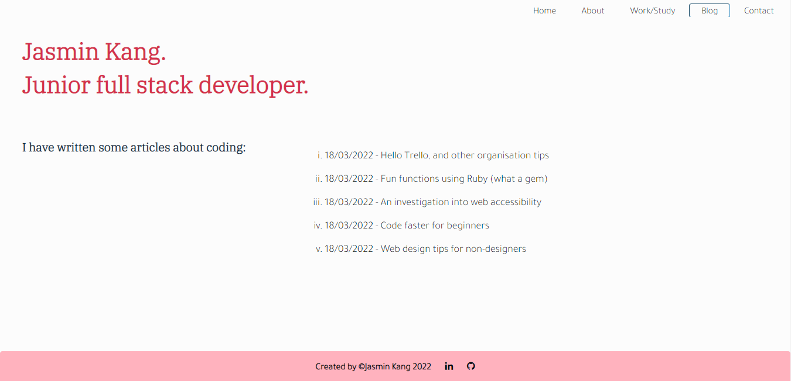
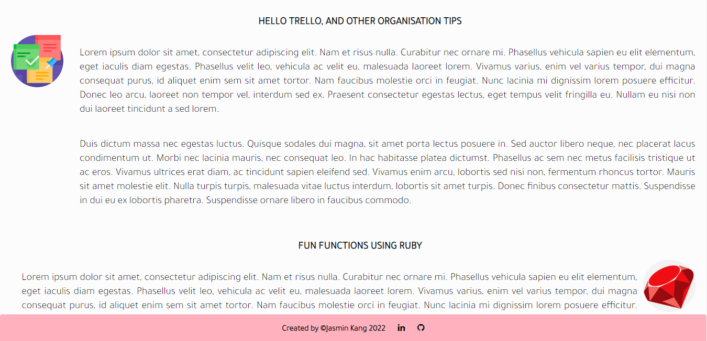
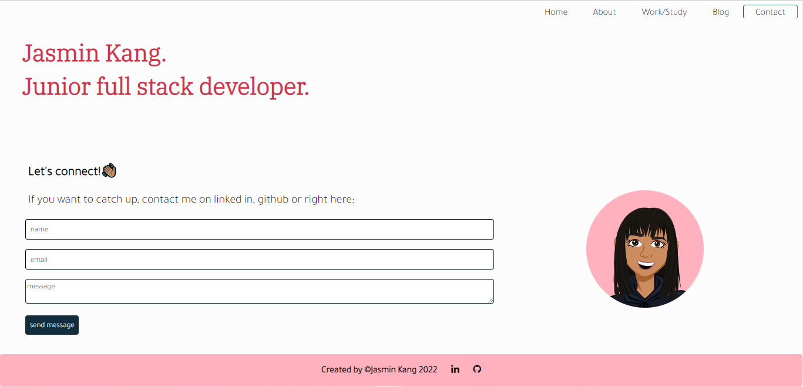

Screenshots for mobile:
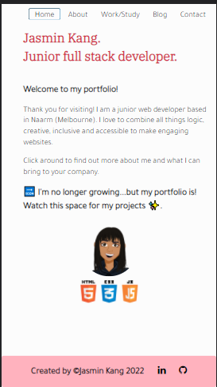
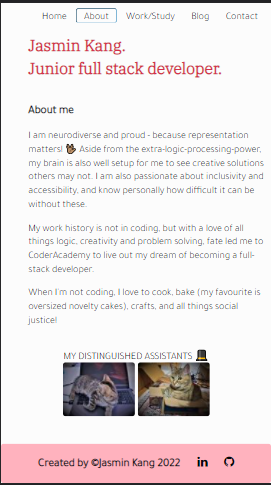
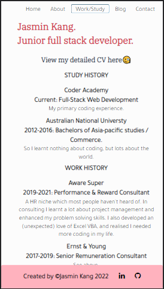
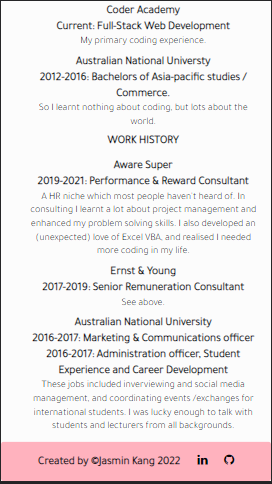
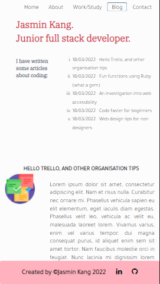
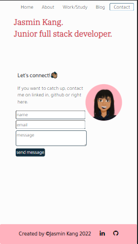

Target Audience: Educators/employers/recruiters

Tech stack: html, css, netlify
